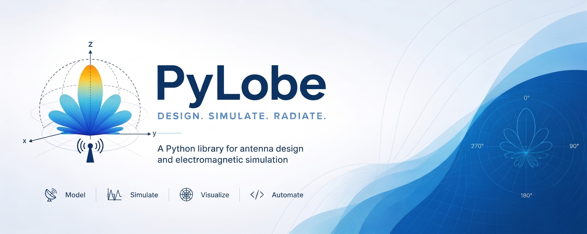

---
# PyLobe

**Comprehensive antenna design, electromagnetic simulation, and AI optimization in Python.**

PyLobe covers the full antenna engineering workflow — from a frequency + substrate specification to a verified, export-ready design — with analytical closed-form models, Method of Moments (MoM), and 3-D FDTD solvers, publication-quality visualization, multi-algorithm optimization, and neural inverse design.

---

## Supported Antenna Types

| Type | Class | Solver |
|---|---|---|
| Half-wave dipole | `HalfWaveDipole` | `DipoleSolver` |
| Folded dipole | `FoldedDipole` | `FoldedDipoleSolver` |
| Bow-tie dipole | `BowTieDipole` | `FoldedDipoleSolver` |
| Quarter-wave monopole | `QuarterWaveMonopole` | `MonopoleSolver` |
| Axial-mode helical | `HelicalMonopole` | `MonopoleSolver` |
| Rectangular patch | `RectangularPatch` | `PatchAnalyticalSolver` |
| Circular patch | `CircularPatch` | `CircularPatchAnalyticalSolver` |
| Annular ring patch | `AnnularRingPatch` | `PatchAnalyticalSolver` |
| E-slot patch | `ESlotPatch` | `PatchAnalyticalSolver` |
| Slot antenna | `SlotAntenna` | `SlotSolver` |
| Vivaldi (tapered-slot) | `VivaldiAntenna` | `FDTDSimulation` |
| Yagi-Uda | `YagiUda` | `YagiAnalyticalSolver` |
| Pyramidal horn | `PyramidalHorn` | `HornSolver` |
| Small loop | `SmallLoopAntenna` | `LoopSolver` |
| Large (resonant) loop | `LargeLoopAntenna` | `LoopSolver` |
| Log-periodic (LPDA) | `LogPeriodicArray` | analytical |
| PIFA | `PIFA` | analytical |
| Koch fractal dipole | `KochDipole` | `DipoleSolver` |
| Sierpinski gasket | `SierpinskiGasket` | `FDTDSimulation` |
| Minkowski patch | `MinkowskiPatch` | `PatchAnalyticalSolver` |
| Linear array (ULA) | `LinearArray` | `DipoleSolver` |
| Planar array | `PlanarArray` | `DipoleSolver` |
| Circular array | `CircularArray` | `DipoleSolver` |

---

## Installation

```bash
git clone https://github.com/abidhasanrafi/pylobe.git
cd pylobe
pip install -e ".[full]"
```

Minimum requirements: Python >= 3.10, NumPy >= 1.24, SciPy >= 1.11, Matplotlib >= 3.7.

Optional extras:

```bash
pip install -e ".[vis]"     # Plotly interactive figures + kaleido PNG export
pip install -e ".[cad]"     # DXF / GDSII / STL export
pip install -e ".[report]"  # PDF design reports
pip install -e ".[ai]"      # Neural surrogate + inverse design (requires PyTorch)
pip install -e ".[full]"    # Everything above
```

---

## Quick Start

### Design a 2.4 GHz patch antenna from scratch

```python
from pylobe import RectangularPatch, PatchAnalyticalSolver, FR4, plot_e_h_plane
import matplotlib.pyplot as plt

# Auto-dimension: transmission-line model computes W, L, and inset depth
patch  = RectangularPatch(freq=2.4e9, substrate_material=FR4, h=1.6e-3, inset_feed=True)
solver = PatchAnalyticalSolver(patch, freq=2.4e9)

print(f"W = {patch.W*1e3:.2f} mm  L = {patch.L*1e3:.2f} mm")
print(f"Inset y0 = {patch.y0*1e3:.2f} mm  (50 ohm match)")

freqs, s11 = solver.s11(Z0=50, n_freq=300)
pattern    = solver.radiation_pattern()
fig = plot_e_h_plane(pattern)
plt.show()
```

### Design a 5-element Yagi for 144 MHz

```python
from pylobe import YagiUda, YagiAnalyticalSolver

yagi = YagiUda(freq=144e6, N_directors=5)
sol  = YagiAnalyticalSolver(yagi, freq=144e6)
pat  = sol.radiation_pattern(181, 181)
sm   = pat.summary()

print(f"Gain  : {sm.peak_gain_dbi:.1f} dBi")
print(f"HPBW  : {sm.hpbw_e_deg:.0f} deg")
print(f"Boom  : {yagi.boom_length * 100:.0f} cm")
```

### Design a standard-gain horn at 10 GHz

```python
from pylobe import PyramidalHorn, HornSolver

horn = PyramidalHorn(freq=10e9)           # auto-selects WR waveguide + aperture
sol  = HornSolver(horn, freq=10e9)
print(f"Gain      : {horn.gain_approx_dbi:.1f} dBi")
print(f"Aperture  : {horn.a_ap*1e3:.0f} x {horn.b_ap*1e3:.0f} mm")
print(f"E-HPBW    : {horn.hpbw_e_deg:.1f} deg")
```

### Run an FDTD simulation

```python
from pylobe import FDTDSimulation, RectangularPatch, FR4

patch = RectangularPatch(freq=2.4e9, substrate_material=FR4, h=1.6e-3)
sim   = FDTDSimulation(patch, grid_resolution=0.5e-3, n_pml_layers=10)
sim.run(n_steps=3000)
pattern = sim.radiation_pattern()
print(pattern.summary())
```

---

## Package Structure

```
pylobe/
├── geometry/          # 23 antenna geometry classes
│   ├── dipole.py      # HalfWaveDipole, FoldedDipole, BowTieDipole
│   ├── monopole.py    # QuarterWaveMonopole, HelicalMonopole
│   ├── patch.py       # RectangularPatch, CircularPatch, AnnularRingPatch, ESlotPatch
│   ├── slot.py        # SlotAntenna, VivaldiAntenna
│   ├── yagi.py        # YagiUda
│   ├── horn.py        # PyramidalHorn
│   ├── loop.py        # SmallLoopAntenna, LargeLoopAntenna
│   ├── lpda.py        # LogPeriodicArray
│   ├── pifa.py        # PIFA
│   ├── fractal.py     # KochDipole, SierpinskiGasket, MinkowskiPatch
│   └── array.py       # LinearArray, PlanarArray, CircularArray
│
├── solver/
│   ├── analytical/    # 10 closed-form solvers
│   │   ├── dipole_solver.py
│   │   ├── patch_solver.py
│   │   ├── monopole_solver.py
│   │   ├── yagi_solver.py
│   │   ├── horn_solver.py
│   │   ├── loop_solver.py
│   │   ├── slot_solver.py
│   │   └── folded_dipole_solver.py
│   ├── fdtd/          # Full 3-D FDTD with PML and NTFF transform
│   └── mom/           # Pocklington MoM for arbitrary wire structures
│
├── analysis/          # RadiationPattern, PatternSummary, SmithChart, lobe analysis
├── optimization/      # GeneticAlgorithm, PSO, DifferentialEvolution, BayesianOptimizer
├── ai/                # NeuralSurrogate, InverseDesigner
├── visualization/     # 40+ plot functions (polar, 3D, Smith, heatmap, dashboard)
└── export/            # DXF, GDSII, STL, JSON, PDF reports
```

---

## Substrate Library

17 pre-defined materials available from `pylobe`:

`FR4`, `RT5880`, `ROGERS4003`, `ROGERS3010`, `ARLON250`, `TEFLON`, `ALUMINA`, `SILICON`, `GaAs`, `FOAM`, `COPPER`, `GOLD`, `SILVER`, `ALUMINUM`, `BRASS`, `PEC`

Custom materials:

```python
from pylobe import Material, register_material
my_sub = Material(name="MyLaminate", eps_r=3.0, loss_tangent=0.001)
register_material(my_sub)
```

---

## Maintainer

**[Md. Abid Hasan Rafi](mailto:ahr16.abidhasanrafi@gmail.com)**
